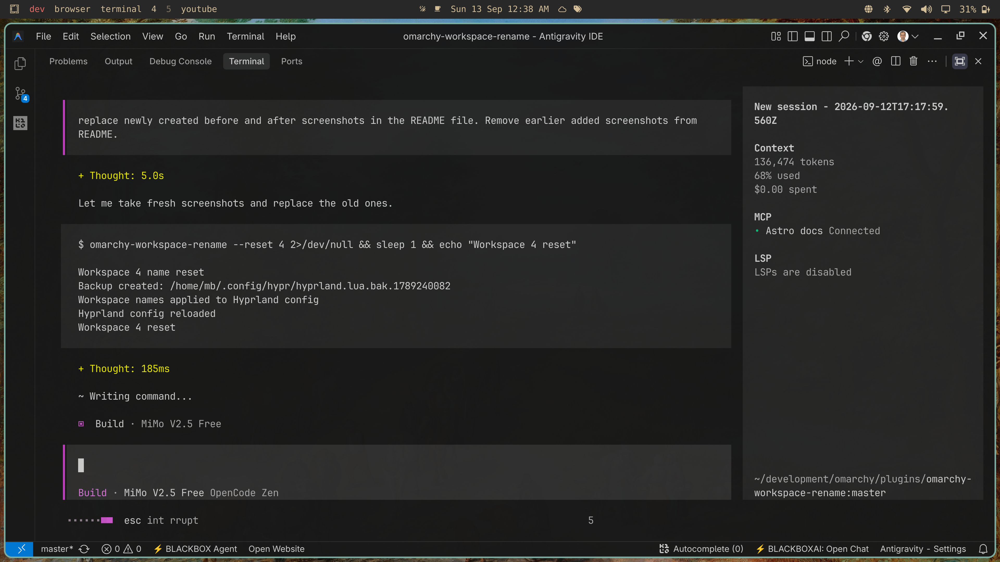
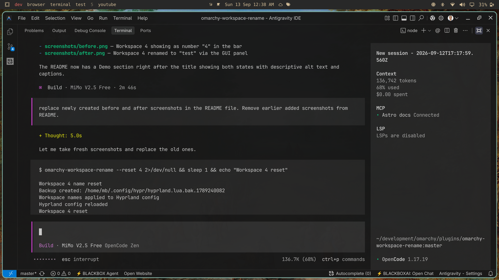

# Workspace Rename

Rename Hyprland workspaces with custom short names via an interactive GUI panel. Names persist across system restarts and Omarchy updates.

## Demo

**Before** — Workspace 4 displays as its default number "4" in the bar:



**After** — Workspace 4 renamed to "test" via the GUI panel:



## Features

- Click-to-rename: Click the focused workspace in the bar to open the rename panel
- Interactive GUI: Type your custom name in a text field
- Persistent: Names survive restarts and Omarchy updates
- Theme-aware: Panel follows your Omarchy theme
- No dependencies: Uses only Omarchy-included tools

## Install

```bash
omarchy plugin add https://github.com/MBhalkar/omarchy-workspace-rename.git --enable
```

After installation, the workspace numbers in your bar will be clickable.

### Dependencies

The plugin uses standard tools included with Omarchy:
- `bash`
- `jq` (for JSON state management)
- `hyprctl` (for Hyprland integration)
- Quickshell (Omarchy's shell framework)

## Usage

### GUI Method

1. **Left-click** any workspace number to switch to that workspace (standard behavior)
2. **Left-click** the **currently focused** workspace to open the rename panel
3. A rename panel appears below with a text field
4. **Type** your custom name
5. **Press Enter** to save, or **Escape** to cancel
6. Click outside the panel to close without saving

### CLI Method

The plugin also provides a command-line tool:

```bash
# Rename a workspace
omarchy-workspace-rename <workspace_id> <new_name>

# Reset a workspace to original number (just provide the ID)
omarchy-workspace-rename <workspace_id>

# List all workspace names
omarchy-workspace-rename --list

# Reset a workspace to default
omarchy-workspace-rename --reset <workspace_id>
```

Examples:
```bash
omarchy-workspace-rename 1 dev
omarchy-workspace-rename 2 web
omarchy-workspace-rename 3 terminal
omarchy-workspace-rename 1          # Resets workspace 1 to just "1"
omarchy-workspace-rename --list
omarchy-workspace-rename --reset 1
```

### Naming Rules

- Workspace IDs must be between 1-10
- Names are limited to 30 characters
- Names cannot contain spaces (use underscores instead)
- Empty names are not allowed

## How it works

1. Displays workspace numbers as clickable buttons in your bar
2. When the focused workspace is clicked, shows a popup panel with a text field
3. Stores your custom names in `~/.local/share/omarchy-workspace-rename/workspace-names.json`
4. Updates workspace rules in `~/.config/hypr/hyprland.lua`
5. Creates automatic backups before modifying Hyprland config
6. Reloads Hyprland to apply changes immediately

Workspace names are formatted as `{id}_{custom_name}` (e.g., `1_dev`, `2_web`), preserving the numeric ID for keyboard navigation while displaying your custom label.

## Data Storage

- **Workspace names**: `~/.local/share/omarchy-workspace-rename/workspace-names.json`
- **Hyprland config**: `~/.config/hypr/hyprland.lua` (automatically backed up before changes)
- **Backups**: `~/.config/hypr/hyprland.lua.bak.<timestamp>`

## Remove

```bash
omarchy plugin remove io.github.mbhalkar.workspace-rename
```

Your workspace names will remain in `~/.local/share/omarchy-workspace-rename/` so reinstalling restores them. To completely remove all data:

```bash
rm -rf ~/.local/share/omarchy-workspace-rename/
```

## License

MIT License - see [LICENSE](LICENSE) for details.
